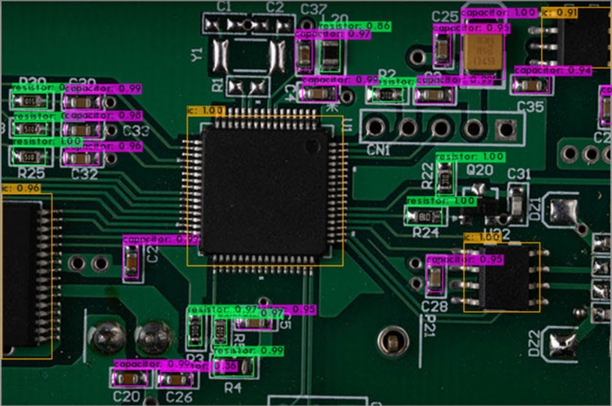
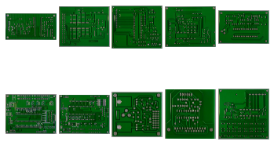
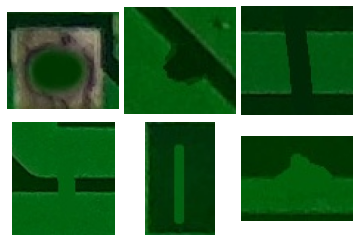
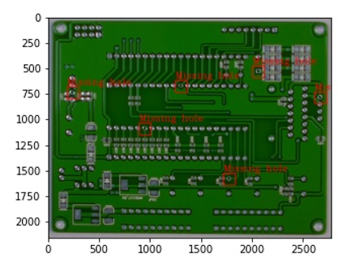

# PCB components and defects inspection using Computer vision and Deep Learning

## Table of content
1. [Introduction](#introduction)
2. [Methods Used](#methods_used)
3. [Applications](#applications)

## Introduction

The printed circuit board (PCB) manufacturing industry has several major bottlenecks, including classification, quality control, and reworking defective boards. 
PCB manufacturing typically involves manual identification and inspection of defects, resulting in longer takt times, higher scrap rates, and the inability to guarantee high-quality production. 
In order to classify and identify defects in PCBs quickly and accurately, an Automated Optical Inspection (AOI) is developed by integrating deep learning and computer vision techniques. 
In this study, three main problems are considered to provide a solution to PCB manufacturing industries

1. Identification of PCB components such as capacitors, integrated circuits, resistors, flexible cables, and computer adapters;
2. Classification of PCB types; 
3. Identification of defects in soldering joints on PCB, such as holes missing, mouse bites, shorts, spurs, and spurious copper.

### Libraries used
- tensorflow | torch | torchvision | OpenCV | sys | os | tqdm | PIL | pyzbar | tkinter | matplotlib | time | numpy | pandas | pickle | csv | math | Keras

## Methods Used

### PCB Components detection
used - YOLOv4 | YOLOv5

<em> Fig 1. Components detection (unknown data). </em>

### PCB type Classification
used - Siamese network, ImageNet models

<em> Fig 2. PCB types we used (total 10 types). </em>

### PCB defect detection and classification
used - Siamese network, ImageNet models, OpenCV (morphological techniques)

<em> Fig 3. Type of defect we detect and classify using multi-model algorithm </em>

<em> Fig 2. PCB defect detection and classification. </em>

## Applications

- Optimized Models for Real-time Detection
- Reduced Inspection Costs and Improved Quality enabling Automated Optical Inspection (AOI)
- Robustness and Flexibility - for its adaptability to new PCB designs

